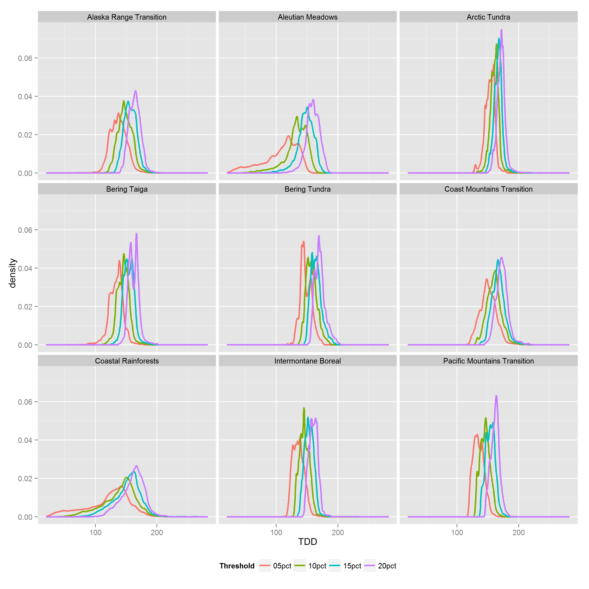
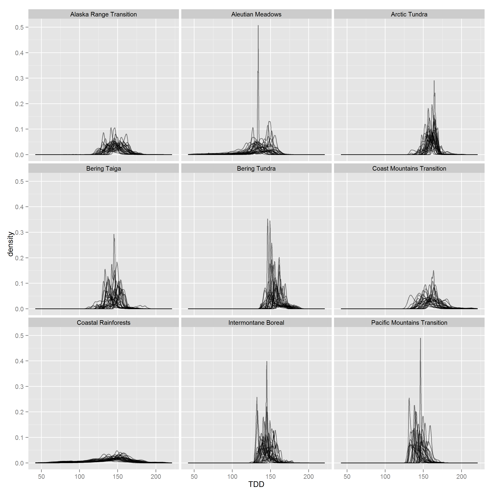

# gs_eda.R

##
##
## Growing season EDA [under development]

Here are some tentative plots and tables related to initial explorations of the thaw degree days (TDD) for the Growing Season project.

First, here is a map of the ecoregions currently in use.

 

### Marginal distributions

#### TDD by threshold and ecoregion

This plot shows propability density fucntions (pdfs) for TDD colored by percent TDD threshold and paneled by ecoregion.
These marginal densities integrate over space (map pixels) and time (years, 1982 - 2010).

 

#### 10% TDD by ecoregion and year

This plot shows the pdf specifically for the 10% TDD variable, by year and ecoregion.
These marginal densities integrate over space only.
Overlapping lines represent pdfs for individual years, 1982 - 2010.

 

The tables below provide aggregate information by TDD threshold and ecoregion.
Means and standard deviations are computed using all grid cells and all years for each combination of threshold and ecoregion.

Table: 5 % Thaw Degree Days.

Region                          Mean   SD
-----------------------------  -----  ---
Aleutian Meadows                 107   29
Coastal Rainforests              120   36
Bering Taiga                     133   12
Pacific Mountains Transition     135    9
Intermontane Boreal              136    9
Alaska Range Transition          137   14
Bering Tundra                    148   10
Coast Mountains Transition       151   13
Arctic Tundra                    153    8

Table: 10 % Thaw Degree Days.

Region                          Mean   SD
-----------------------------  -----  ---
Aleutian Meadows                 132   19
Coastal Rainforests              139   27
Bering Taiga                     145   10
Pacific Mountains Transition     145    8
Intermontane Boreal              146    8
Alaska Range Transition          148   12
Bering Tundra                    158    9
Coast Mountains Transition       160   12
Arctic Tundra                    161    7

Table: 15 % Thaw Degree Days.

Region                          Mean   SD
-----------------------------  -----  ---
Aleutian Meadows                 147   14
Coastal Rainforests              151   22
Intermontane Boreal              153    8
Pacific Mountains Transition     154    8
Bering Taiga                     154    9
Alaska Range Transition          157   11
Bering Tundra                    165    9
Arctic Tundra                    166    7
Coast Mountains Transition       167   11

Table: 20 % Thaw Degree Days.

Region                          Mean   SD
-----------------------------  -----  ---
Aleutian Meadows                 159   11
Intermontane Boreal              160    7
Coastal Rainforests              161   18
Pacific Mountains Transition     162    7
Bering Taiga                     162    9
Alaska Range Transition          164   10
Bering Tundra                    171    9
Arctic Tundra                    172    8
Coast Mountains Transition       173   10
